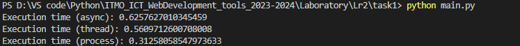

# Задача 1
Каждый из подходов используется для решения задачи суммирования всех чисел от 1 до 1000000, разбивая вычисления на несколько параллельных задач для ускорения выполнения.

## Async \ Await

```python
import asyncio
from value import N,num_tasks
async def calculate_sum(start, end):
    return sum(range(start, end))

async def main():
    tasks = []
    step = N // num_tasks

    for i in range(num_tasks):
        start = i * step + 1
        end = (i + 1) * step + 1 if i < num_tasks - 1 else N+1
        tasks.append(asyncio.create_task(calculate_sum(start, end)))

    partial_sums = await asyncio.gather(*tasks)
    total_sum = sum(partial_sums)
    print("Total sum:", total_sum)

if __name__ == "__main__":
    import time
   
    start_time = time.time()
    asyncio.run(main())
    print("Execution time (async):", time.time() - start_time)
```

## Threading

```python
import threading
from value import N,num_tasks
def calculate_sum(start, end, result):
    partial_sum = sum(range(start, end))
    result.append(partial_sum)

def main():
    result = []
    threads = []
    step = N // num_tasks

    for i in range(num_tasks):
        start = i * step + 1
        end = (i + 1) * step + 1 if i < num_tasks - 1 else N+1
        thread = threading.Thread(target=calculate_sum, args=(start, end, result))
        threads.append(thread)
        thread.start()

    for thread in threads:
        thread.join()

    total_sum = sum(result)
    print("Total sum:", total_sum)

if __name__ == "__main__":
    import time
    
    start_time = time.time()
    main()
    print("Execution time (thread):", time.time() - start_time)
```

## Multiprocessing

```python
import multiprocessing
from value import N,num_tasks
def calculate_sum(start, end, result):
    partial_sum = sum(range(start, end))
    result.put(partial_sum)

def main():
    result = multiprocessing.Queue()
    processes = []
    step = N // num_tasks

    for i in range(num_tasks):
        start = i * step + 1
        end = (i + 1) * step + 1 if i < num_tasks - 1 else N+1
        process = multiprocessing.Process(target=calculate_sum, args=(start, end, result))
        processes.append(process)
        process.start()

    for process in processes:
        process.join()

    total_sum = 0
    while not result.empty():
        total_sum += result.get()

    print("Total sum:", total_sum)

if __name__ == "__main__":
    import time
    start_time = time.time()
    main()
    print("Execution time (process):", time.time() - start_time)
```

## Результаты сравнения
-   N = 1000000


-   N = 10000000
  

В примере с N=1000000 мы видим, что медленнее всего работает мультипроцесс, за ним следуют потоки и асинхронность, а в примере с N=10000000, наоборот, мультипроцесс является самым быстрым. Многопроцессорный модуль работает медленнее в случае N = 1000000 из-за накладных расходов, связанных с запуском нового процесса. Каждый процесс выполняется в своем собственном пространстве памяти, поэтому программе приходится выполнять дополнительную работу для настройки этого пространства и взаимодействия между процессами. Эти накладные расходы могут замедлить многопроцессорную обработку для задач, выполнение которых не занимает много времени, как в примере.


## Выводы

Вычисление суммы первых 1 000 000 чисел — задача, связанная с процессором. Это означает, что скорость задачи ограничена скоростью процессора. В этом случае многопроцессорная обработка должна быть самой быстрой, поскольку она может использовать преимущества нескольких ядер ЦП для истинного параллелизма. Потоки и асинхронность не будут такими быстрыми, поскольку они выполняются в одном процессе и, следовательно, не могут обеспечить настоящий параллелизм на многоядерном процессоре.